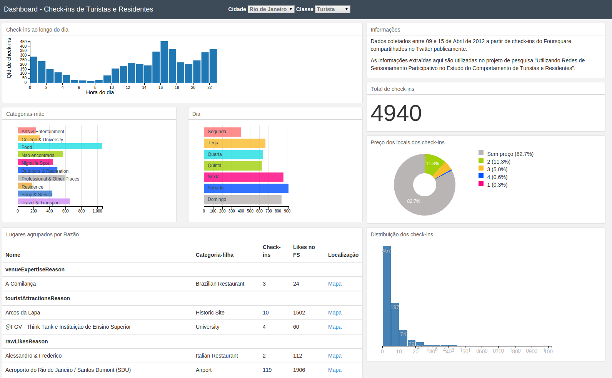

## Dashboard usando Python + Flask + DC.js/D3.js/Crossfilter.js + Keen.IO + GAE

Este projeto foi desenvolvido para a disciplina de Visualização de Dados do PPGCC-UFMG.

O objetivo principal é aplicar os conceitos da disciplina em algo prático. Neste projeto existem diversas formas de visualização de dados.
Alguns dados são grandes e estão em arquivos de texto. :( Por isso em alguns momentos a visualização pode ficar lenta.

Estreando no projeto Python, Flask, DC.js, D3.js, Crossfilter.js, Keen.IO e Google App Engine, com participação especial do jQuery.

### Flask

O [Flask](http://flask.pocoo.org) é um micro framework escrito em Python. A partir dele é possível criar uma aplicação web com serviços REST, por exemplo, de maneira rápida.

### DC.js / D3.js / Crossfilter.js

O [D3.js](http://d3js.org) é uma biblioteca para visualização de dados que possui componentes muito elegantes. Entretanto, sua manipulação não é muito fácil.
Para ajudar nessa tarefa de manipulação dos dados usamos o [DC.js](http://dc-js.github.io/dc.js/) e o [Crossfilter.js](http://square.github.com/crossfilter/).
O DC.js é uma biblioteca que torna fácil a manipulação dos dados e plota os componentes utilizando o D3. Mas para que a manipulação dos dados seja feita de maneira rápida, utiliza o Crossfilter, uma biblioteca que torna possível a manipulação de maneira multidimensional.
Tarefas como agrupar os dados, somar valores e classificá-los tornam-se muito mais fáceis utilizando essas bibliotecas. Neste projeto tem um gráfico apenas utilizando D3js puro, enquanto os demais são feitos utilizando o DC e o Crossfilter; a diferença é gritante.
Além dessas bibliotecas, também uso o jQuery pra manipular os elementos de maneira mais fácil.

### Keen.IO

O [Keen.IO](http://keen.github.io/dashboards/) é quem deixa este Dashboard com uma cara bonita. :) Ele utiliza o Bootstrap (e o jQuery também) para criar contâneirs para elementos em uma aplicação. Pra quem não manja nada de design como eu, é uma mão na roda.

### Google App Engine

Esta aplicação está hospedada no Google App Engine. Para usar o GAE com Python, instale o [App Engine Python SDK](https://developers.google.com/appengine/downloads) e siga as instruções.

PS.: Eu não sou expert nessas tecnologias, então você deve encontrar umas gambiarras pelo caminho. Se este for o caso, pode me dar um feedback. Gostaria de aprender mais!
